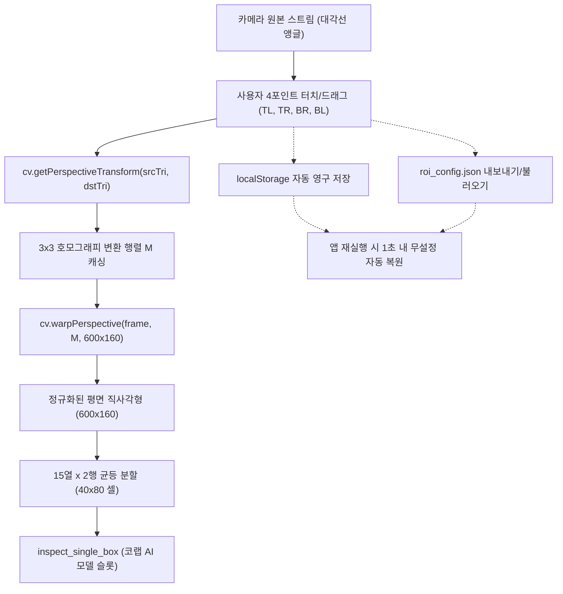

# [기술 위키] 4포인트 원근 보정(Perspective Warp) 캘리브레이션 및 ROI 설정 자동 저장

## 1. 아키텍처 개요
현장 카메라가 컨베이어 벨트 작업대 상부 대각선에서 비스듬히 내려다볼 때 발생하는 사다리꼴 원근 투영 왜곡(Perspective Distortion)을 10초 만에 완벽히 정규화(Unwarp)하기 위한 경량 고속 비전 파이프라인입니다.



---

## 2. 핵심 알고리즘 및 엔진

### 2.1 Bilinear 보간 오버레이 투영 (Projective Mapping)
화면상의 4개 꼭짓점 $P_{TL}, P_{TR}, P_{BR}, P_{BL}$을 기준으로 정규화 좌표 $(u, v) \in [0, 1] \times [0, 1]$을 원본 화면 좌표 $(x, y)$로 매핑합니다:
$$P(u, v) = (1-u)(1-v) P_{TL} + u(1-v) P_{TR} + uv P_{BR} + (1-u)v P_{BL}$$

이를 통해 15열 × 2행의 30개 왜곡 사각 셀과 중심 번호(#1 ~ #30)가 카메라 원본 화면상에 왜곡 없이 정확하게 실시간 오버레이됩니다.

### 2.2 OpenCV.js Perspective Warp 평면 추출
- 입력: $src = [TL, TR, BR, BL]$
- 출력: $dst = [(0, 0), (600, 0), (600, 160), (0, 160)]$
- 변환: `cv.warpPerspective`를 수행하여 왜곡 없는 반듯한 $600 \times 160$ 평면 이미지를 획득한 후, 각 $40 \times 80$ 셀 단위로 크롭하여 전도 판별 및 템플릿 매칭을 수행합니다.

---

## 3. 설정 영구 보존 스키마 (`roi_config.json`)
```json
{
  "version": "1.0.0",
  "updatedAt": "2026-09-27T14:00:00.000Z",
  "referenceResolution": { "width": 860, "height": 500 },
  "warpOutput": { "width": 600, "height": 160, "rows": 2, "cols": 15 },
  "points": [
    { "name": "TL (좌상)", "x": 60, "y": 120 },
    { "name": "TR (우상)", "x": 800, "y": 90 },
    { "name": "BR (우하)", "x": 830, "y": 390 },
    { "name": "BL (좌하)", "x": 30, "y": 370 }
  ]
}
```

---

## 4. 현장 10초 세팅 매뉴얼
1. 웹앱(`box_tilt.html`)을 브라우저로 엽니다.
2. 화면에 표시된 4개의 번호 동그라미(①좌상, ②우상, ③우하, ④좌하)를 손가락(터치)이나 마우스로 드래그하여 30개 소박스 묶음의 네 모서리에 맞춥니다.
3. 드래그를 마치는 즉시 브라우저 `localStorage`에 자동 저장되며, 다음 접속 시 자동으로 복원됩니다.
4. 상단의 [💾 JSON 저장] 버튼을 누르면 다른 기기나 PC로 복사할 수 있는 `roi_config.json` 백업 파일이 다운로드됩니다.
